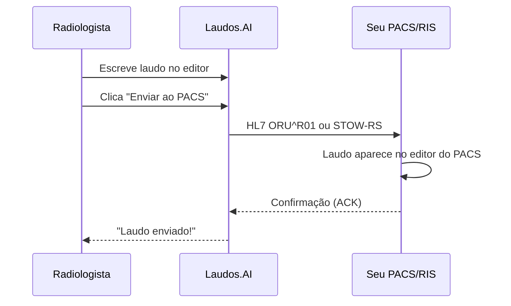

# Bem-vindo à API do Laudos.AI

<Note>
  **Feito para hospitais brasileiros.** Suporte nativo a Carestream, MV Soul, Tasy, Pixeon e todos os principais sistemas do mercado.
</Note>

## Por que integrar?

<CardGroup cols={2}>
  <Card title="Elimine digitação dupla" icon="keyboard">
    O radiologista escreve uma vez no Laudos.AI e o laudo vai direto pro PACS/RIS
  </Card>
  <Card title="Setup em 5 minutos" icon="clock">
    Presets prontos para os principais sistemas brasileiros
  </Card>
  <Card title="Zero PHI armazenado" icon="shield-check">
    Apenas credenciais de conexão - nenhum dado de paciente passa pelos nossos servidores
  </Card>
  <Card title="Protocolos padrão" icon="plug">
    HL7 v2.x, DICOMweb STOW-RS, FHIR R4 - sem APIs proprietárias
  </Card>
</CardGroup>

## Como funciona

## Sistemas Suportados

### Brasil (HL7 ORU^R01 via MLLP)

| Sistema | Protocolo | Porta Padrão |
|---------|-----------|--------------|
| **Carestream Vue** | HL7 v2.5 | 2575 |
| **MV Soul / VIVACE** | HL7 v2.5 | 2575 |
| **Tasy (Philips)** | HL7 v2.5 | 2575 |
| **Pixeon** | HL7 + DICOMweb | 2575 / 8042 |
| **MV 2000** | HL7 v2.5 | 2575 |
| **Wareline** | HL7 v2.5 | 2575 |

### Internacional (DICOMweb STOW-RS)

| Sistema | Protocolo | Porta Padrão |
|---------|-----------|--------------|
| **Philips IntelliSpace** | STOW-RS + TLS | 443 |
| **Siemens syngo.via** | STOW-RS + TLS | 443 |
| **GE Centricity** | STOW-RS | 8042 |
| **Fujifilm Synapse** | STOW-RS + TLS | 443 |
| **Agfa Enterprise** | STOW-RS | 8042 |
| **Orthanc** | STOW-RS | 8042 |
| **dcm4chee** | STOW-RS | 8080 |

## Início Rápido

<Steps>
  <Step title="Configure a conexão">
    Vá em **Configurações → Integrações → PACS** e adicione seu servidor
  </Step>
  <Step title="Teste a conexão">
    Clique em "Testar" para verificar conectividade
  </Step>
  <Step title="Envie um laudo">
    No editor, clique em **"Enviar ao PACS"** após finalizar o laudo
  </Step>
</Steps>

## Integrações Disponíveis

<CardGroup cols={2}>
  <Card title="PACS/RIS" icon="server" href="/developers/integracao-pacs">
    Envie laudos diretamente para o editor do PACS via HL7 ou DICOMweb
  </Card>
  <Card title="API REST" icon="code" href="/developers/autenticacao-api">
    Acesse laudos, templates e configurações via API
  </Card>
  <Card title="Webhooks" icon="webhook" href="/developers/webhooks">
    Receba notificações em tempo real (laudo finalizado, achado crítico, etc.)
  </Card>
  <Card title="SDKs" icon="cube" href="/developers/sdk">
    Bibliotecas oficiais para Node.js e Python
  </Card>
</CardGroup>

## Ambientes

| Ambiente | Base URL | Uso |
|----------|----------|-----|
| **Produção** | `https://api.laudos.ai/v1` | Dados reais |
| **Sandbox** | `https://sandbox.api.laudos.ai/v1` | Testes |

## Rate Limits

| Plano | Requests/min | Requests/dia |
|-------|--------------|--------------|
| Pro | 60 | 10.000 |
| Enterprise | 300 | 100.000 |
| Unlimited | Sem limite | Sem limite |

## Precisa de ajuda?

<CardGroup cols={2}>
  <Card title="Documentação Técnica" icon="book" href="/developers/integracao-pacs">
    Guias detalhados de integração
  </Card>
  <Card title="Suporte" icon="headset" href="mailto:integracoes@laudos.ai">
    integracoes@laudos.ai
  </Card>
</CardGroup>
