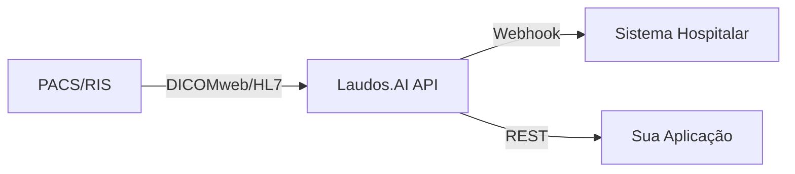

# Integração para Desenvolvedores

O Laudos.AI oferece APIs robustas para integração com sistemas hospitalares, permitindo automatizar fluxos de trabalho radiológicos.

<CardGroup cols={2}>
  <Card title="PACS/RIS" icon="server" href="/developers/integracao-pacs">
    Integração com sistemas PACS e RIS via DICOMweb e HL7
  </Card>
  <Card title="Autenticação" icon="key" href="/developers/autenticacao-api">
    Autenticação via API Keys e OAuth 2.0
  </Card>
  <Card title="Webhooks" icon="webhook" href="/developers/webhooks">
    Receba notificações em tempo real
  </Card>
  <Card title="SDK" icon="cube" href="/developers/sdk">
    Bibliotecas oficiais para Node.js e Python
  </Card>
</CardGroup>

## Visão Geral

## Protocolos Suportados

| Protocolo | Versão | Uso Principal |
|-----------|--------|---------------|
| DICOMweb | STOW-RS | Envio de laudos estruturados (SR) |
| HL7 | v2.5.1 | Mensagens ORU^R01 para PACS legados |
| FHIR | R4 | Integração com EHR modernos |
| REST | JSON | API geral para aplicações |

## Ambientes

| Ambiente | Base URL |
|----------|----------|
| Produção | `https://api.laudos.ai/v1` |
| Sandbox | `https://sandbox.api.laudos.ai/v1` |

<Note>
  Para acesso à API, entre em contato com nossa equipe de integrações em [integracoes@laudos.ai](mailto:integracoes@laudos.ai)
</Note>

## Rate Limits

| Plano | Requests/min | Requests/dia |
|-------|--------------|--------------|
| Pro | 60 | 10.000 |
| Enterprise | 300 | 100.000 |
| Unlimited | Sem limite | Sem limite |

## Próximos Passos

<Steps>
  <Step title="Solicitar Acesso">
    Entre em contato para receber suas credenciais de API
  </Step>
  <Step title="Configurar Ambiente">
    Configure seu ambiente de desenvolvimento com nossas SDKs
  </Step>
  <Step title="Testar Integração">
    Use o ambiente sandbox para validar sua integração
  </Step>
  <Step title="Ir para Produção">
    Após validação, migre para o ambiente de produção
  </Step>
</Steps>
