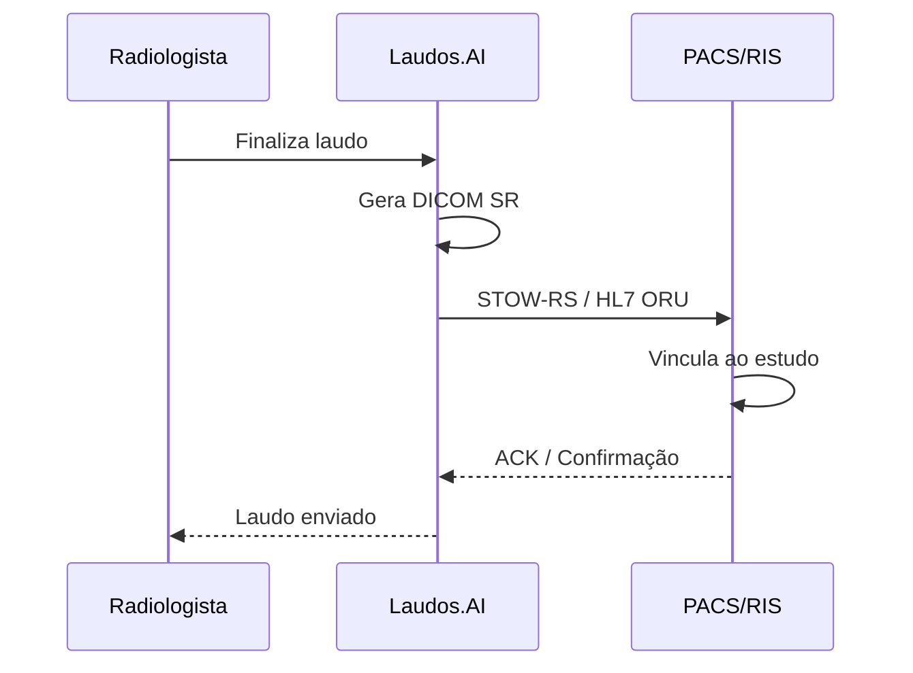

# Integração com PACS/RIS

O Laudos.AI suporta integração bidirecional com sistemas PACS e RIS, permitindo envio automático de laudos estruturados.

## Sistemas Suportados

<CardGroup cols={3}>
  <Card title="Orthanc" icon="cube">
    DICOMweb nativo
  </Card>
  <Card title="DCM4CHEE" icon="cube">
    STOW-RS / WADO
  </Card>
  <Card title="Carestream" icon="cube">
    HL7 v2.x
  </Card>
  <Card title="MV Soul" icon="cube">
    HL7 / DICOMweb
  </Card>
  <Card title="Tasy/Philips" icon="cube">
    HL7 v2.5
  </Card>
  <Card title="Pixeon" icon="cube">
    REST / HL7
  </Card>
</CardGroup>

## Protocolos

### DICOMweb (STOW-RS)

Protocolo moderno baseado em REST para envio de objetos DICOM.

```bash
POST /api/v1/pacs/connections/{id}/send
Content-Type: application/json

{
  "study_instance_uid": "1.2.840.113619.2.xxx",
  "report_text": "TÉCNICA: RM de crânio...",
  "accession_number": "ACC12345",
  "modality": "MR"
}
```

#### Resposta de Sucesso

```json
{
  "success": true,
  "message": "Laudo enviado ao PACS",
  "protocol": "dicomweb",
  "sop_instance_uid": "1.2.840.xxx.xxx"
}
```

### HL7 v2.x (ORU^R01)

Para sistemas legados que utilizam HL7 via MLLP.

```bash
POST /api/v1/pacs/connections/{id}/send
Content-Type: application/json

{
  "protocol": "hl7",
  "accession_number": "ACC12345",
  "report_text": "TÉCNICA: TC de tórax...",
  "patient_id": "PAT001",
  "reporting_radiologist": "Dr. Silva"
}
```

#### Estrutura da Mensagem HL7

```
MSH|^~\&|LAUDOSAI|LAUDOSAI|PACS|HOSPITAL|...|ORU^R01^ORU_R01|...|P|2.5.1
PID|1||PAT001||Silva^João||...
OBR|1|ACC12345||RAD^Radiology Report^L|...
OBX|1|TX|RAD^Radiology Report^L||TÉCNICA: TC de tórax...||||||P
```

## Configurar Conexão

### Via API

```bash
POST /api/v1/pacs/connections
Authorization: Bearer sk_live_xxx

{
  "name": "PACS Principal",
  "type": "orthanc",
  "host": "pacs.hospital.com",
  "port": 8042,
  "ae_title": "ORTHANC",
  "dicomweb_url": "https://pacs.hospital.com/dicom-web",
  "auth_type": "basic",
  "username": "laudosai",
  "password": "secure_password"
}
```

### Testar Conexão

```bash
POST /api/v1/pacs/connections/{id}/test

# Resposta
{
  "success": true,
  "message": "Conexão estabelecida",
  "latency_ms": 45,
  "server_info": {
    "server": "Orthanc/1.12.0"
  }
}
```

## Fluxo de Integração



## Status do Laudo

| Status | Código DICOM | Descrição |
|--------|--------------|-----------|
| Preliminar | P | Aguardando revisão |
| Final | F | Laudo finalizado |
| Corrigido | C | Correção de laudo anterior |
| Cancelado | X | Laudo cancelado |

## Tratamento de Erros

```json
{
  "success": false,
  "error": "CONNECTION_TIMEOUT",
  "message": "Timeout ao conectar ao PACS",
  "details": "Host pacs.hospital.com não respondeu em 30s"
}
```

| Código | Causa | Ação |
|--------|-------|------|
| `CONNECTION_TIMEOUT` | PACS não responde | Verificar firewall/rede |
| `AUTH_FAILED` | Credenciais inválidas | Verificar username/password |
| `STOW_REJECTED` | PACS rejeitou SR | Verificar formato DICOM |
| `HL7_NACK` | PACS rejeitou HL7 | Verificar estrutura mensagem |

## Requisitos de Rede

<Warning>
  Configure seu firewall para permitir conexões do Laudos.AI.
</Warning>

| Direção | Porta | Protocolo | Uso |
|---------|-------|-----------|-----|
| Saída | 443 | HTTPS | DICOMweb |
| Saída | 104 | DICOM | C-STORE (legado) |
| Saída | 2575 | TCP | HL7 MLLP |

### IPs do Laudos.AI

```
Produção:
  - 34.95.xxx.xxx
  - 35.198.xxx.xxx

Sandbox:
  - 34.95.xxx.xxx
```

<Note>
  Para IPs atualizados, consulte [status.laudos.ai/ips](https://status.laudos.ai/ips)
</Note>
