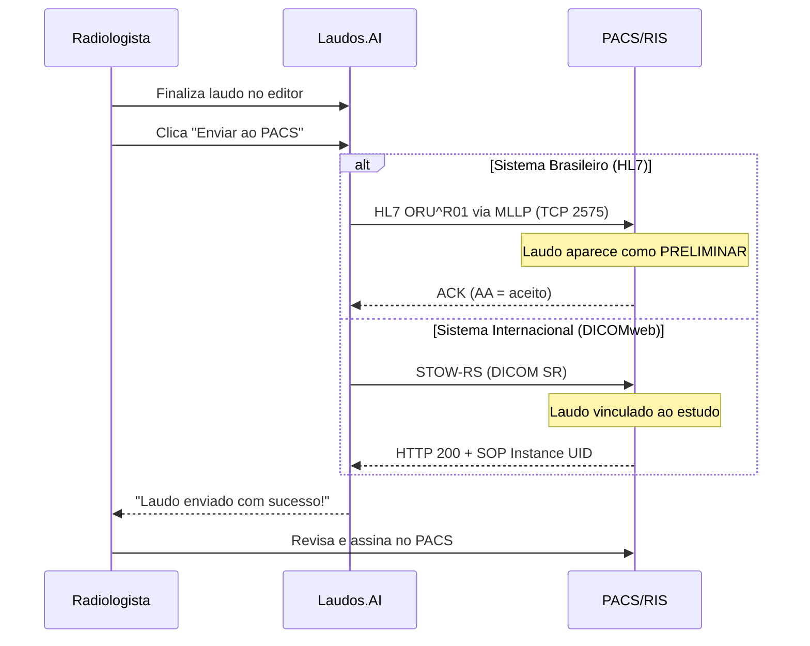

# Integracao com PACS/RIS

O Laudos.AI envia laudos estruturados diretamente para o editor do seu PACS. O radiologista so precisa revisar e assinar.

<Note>
  **One-way push.** O Laudos.AI apenas ENVIA laudos. Nenhum dado de paciente e consultado ou armazenado.
</Note>

## Fluxo de Integracao



---

## Sistemas Compativeis

### Protocolo HL7 ORU^R01 via MLLP

| Sistema | Tipo | Observacao |
|---------|------|-----------|
| Carestream Vue | `carestream` | PACS mais comum no Brasil |
| MV Soul / VIVACE | `mvsoul` | Suporte a CRM no campo do medico |
| Philips Tasy | `tasy` | HIS/RIS brasileiro |
| Pixeon | `pixeon` | PACS brasileiro |
| MV 2000 | `mv2000` | Versao legada do MV |
| Wareline | `wareline` | RIS brasileiro |

### Protocolo DICOMweb STOW-RS

| Sistema | Tipo | Observacao |
|---------|------|-----------|
| Orthanc | `dicomweb` | Open source, ideal para testes |
| dcm4chee | `dicomweb` | Open source, enterprise |
| Philips IntelliSpace | `dicomweb` | PACS internacional |
| Siemens syngo.via | `dicomweb` | PACS internacional |
| GE Centricity | `dicomweb` | PACS internacional |
| Fujifilm Synapse | `dicomweb` | PACS internacional |
| Agfa IMPAX | `dicomweb` | PACS internacional |

### API XML Proprietaria

| Sistema | Tipo | Observacao |
|---------|------|-----------|
| MV Soul | `mvsoul` | API XML/SOAP alternativa ao HL7 |

---

## Configuracao por Sistema

### Carestream Vue

```
Host: IP do servidor Carestream
Porta: 2575
Protocolo: HL7 ORU^R01
```

<Accordion title="Exemplo de mensagem HL7">
```
MSH|^~\&|LAUDOSAI|LAUDOSAI|CARESTREAM|HOSPITAL|20260127103000||ORU^R01^ORU_R01|MSG001|P|2.5.1
PID|1||PAT001||Silva^Joao||19800515|M
OBR|1|ACC12345||RAD^TC Torax^L|||||||||||||||||P|||||||Souza^Dr. Carlos
OBX|1|TX|RAD^Radiology Report^L||TECNICA: TC de torax sem contraste...||||||P
OBX|2|TX|RAD^Radiology Report^L||ANALISE: Parenquima pulmonar de aspecto normal...||||||P
OBX|3|TX|RAD^Radiology Report^L||CONCLUSAO: Exame dentro dos limites da normalidade.||||||P
```
</Accordion>

### MV Soul / VIVACE

Suporta dois protocolos:

<Tabs>
  <Tab title="HL7 (Recomendado)">
    ```
    Host: IP do servidor MV
    Porta: 2575
    Protocolo: HL7 ORU^R01
    ```

    O nome do medico inclui o CRM no formato: `Sobrenome^Nome^CRM^UF`

    <Accordion title="Exemplo de mensagem HL7 com CRM">
    ```
    MSH|^~\&|LAUDOSAI|LAUDOSAI|MVSOUL|MV|20260127103000||ORU^R01^ORU_R01|MSG001|P|2.5.1
    PID|1||12345678900||Silva Filho^Joao||19800515|M
    OBR|1|ACC12345||RAD^RM Cranio^L|||||||||||||||||P|||||||Souza^Carlos^123456^SP
    OBX|1|TX|RAD^Radiology Report^L||TECNICA: RM de cranio...||||||P
    ```
    </Accordion>
  </Tab>
  <Tab title="XML API">
    Se o MV tiver a API XML habilitada:

    ```
    URL: https://mv.hospital.com.br/api/laudos
    Autenticacao: Basic ou API Key
    Content-Type: application/xml
    ```

    <Accordion title="Exemplo de XML enviado">
    ```xml
    <?xml version="1.0" encoding="UTF-8"?>
    <MV_LAUDO version="1.0">
      <HEADER>
        <SISTEMA_ORIGEM>LAUDOSAI</SISTEMA_ORIGEM>
        <SISTEMA_DESTINO>MVSOUL</SISTEMA_DESTINO>
        <TIPO_MENSAGEM>LAUDO</TIPO_MENSAGEM>
      </HEADER>
      <EXAME>
        <NR_ACESSO>ACC12345</NR_ACESSO>
        <MODALIDADE>CT</MODALIDADE>
      </EXAME>
      <LAUDO>
        <STATUS>P</STATUS>
        <TEXTO><![CDATA[TECNICA: TC de torax...]]></TEXTO>
      </LAUDO>
      <MEDICO>
        <CRM>123456</CRM>
        <NM_MEDICO>Dr. Carlos Souza</NM_MEDICO>
      </MEDICO>
    </MV_LAUDO>
    ```
    </Accordion>
  </Tab>
</Tabs>

### Tasy (Philips Brasil)

```
Host: IP do servidor Tasy
Porta: 2575
Protocolo: HL7 ORU^R01
```

### Pixeon

```
Host: IP do servidor Pixeon
Porta: 2575
Protocolo: HL7 ORU^R01
```

### DICOMweb (Orthanc, dcm4chee, Philips, Siemens, GE, Fujifilm, Agfa)

```
Host: IP ou hostname do servidor
Porta: 8042 (HTTP) ou 443 (HTTPS)
Protocolo: STOW-RS
DICOMweb URL: /dicom-web (varia por fabricante)
```

<Accordion title="Exemplo de DICOM SR JSON">
```json
{
  "00080016": {"vr": "UI", "Value": ["1.2.840.10008.5.1.4.1.1.88.11"]},
  "00080018": {"vr": "UI", "Value": ["2.25.xxxxx"]},
  "0020000D": {"vr": "UI", "Value": ["1.2.840.xxxxx"]},
  "00080060": {"vr": "CS", "Value": ["SR"]},
  "0040A040": {"vr": "CS", "Value": ["CONTAINER"]},
  "0040A730": {
    "vr": "SQ",
    "Value": [{
      "0040A040": {"vr": "CS", "Value": ["TEXT"]},
      "0040A160": {"vr": "UT", "Value": ["TECNICA: TC de torax..."]}
    }]
  },
  "0040A491": {"vr": "CS", "Value": ["PARTIAL"]},
  "0040A493": {"vr": "CS", "Value": ["UNVERIFIED"]}
}
```
</Accordion>

---

## Status do Laudo

O laudo e sempre enviado como **PRELIMINAR** para que o radiologista revise e assine no PACS.

| Status DICOM | Codigo | Significado |
|--------------|--------|-------------|
| Preliminar | P | Aguardando revisao |
| Final | F | Assinado pelo medico |
| Corrigido | C | Correcao de laudo anterior |

---

## Requisitos de Rede

<Warning>
  Configure seu firewall para permitir conexoes de saida do Laudos.AI.
</Warning>

| Direcao | Porta | Protocolo | Uso |
|---------|-------|-----------|-----|
| Saida | 2575 | TCP | HL7 MLLP |
| Saida | 8042 | HTTPS | DICOMweb |
| Saida | 443 | HTTPS | DICOMweb TLS |

---

## Tratamento de Erros

| Codigo | Erro | Solucao |
|--------|------|---------|
| `CONNECTION_TIMEOUT` | Servidor nao respondeu | Verificar firewall e porta |
| `AUTH_FAILED` | Autenticacao falhou | Verificar credenciais |
| `HL7_NACK` | Mensagem rejeitada pelo PACS | Verificar dados do paciente/exame |
| `STOW_REJECTED` | PACS rejeitou SR | Verificar Study Instance UID |

---

## FAQ

<AccordionGroup>
  <Accordion title="O laudo substitui o que esta no PACS?">
    Nao. O laudo e enviado como PRELIMINAR e adiciona uma nova serie ao estudo. O radiologista deve revisar e finalizar no PACS.
  </Accordion>
  <Accordion title="Preciso do Study Instance UID?">
    Para HL7 (sistemas brasileiros), apenas o Numero de Acesso e necessario. Para DICOMweb, o Study Instance UID e requerido.
  </Accordion>
  <Accordion title="Funciona com VPN?">
    Sim. Configure a VPN para permitir trafego nas portas 2575 (HL7) ou 8042/443 (DICOMweb).
  </Accordion>
  <Accordion title="Suporta TLS/SSL?">
    Sim. Marque "Usar TLS" na configuracao da conexao.
  </Accordion>
  <Accordion title="Quantos sistemas sao suportados?">
    Atualmente suportamos 14 sistemas via 3 protocolos: HL7 MLLP (Carestream, MV Soul, Tasy, Pixeon, MV 2000, Wareline), DICOMweb STOW-RS (Orthanc, dcm4chee, Philips, Siemens, GE, Fujifilm, Agfa) e XML API (MV Soul).
  </Accordion>
</AccordionGroup>

---

## Precisa de ajuda?

Entre em contato com nossa equipe de integracoes:

- **Email**: [oi@laudos.ai](mailto:oi@laudos.ai)
