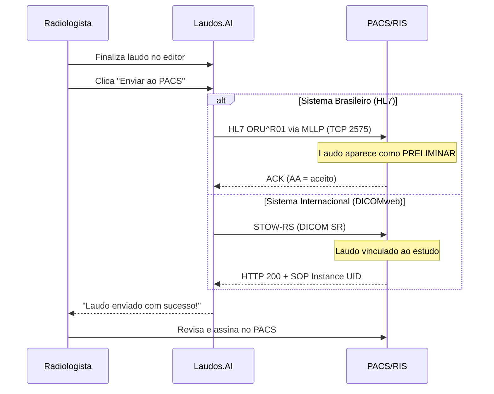

# Integração com PACS/RIS

O Laudos.AI envia laudos estruturados diretamente para o editor do seu PACS. O radiologista só precisa revisar e assinar.

<Note>
  **One-way push.** O Laudos.AI apenas ENVIA laudos. Nenhum dado de paciente é consultado ou armazenado.
</Note>

## Fluxo de Integração



## Configuração por Sistema

### Carestream Vue (Brasil)

```bash
Host: IP do servidor Carestream
Porta HL7: 2575
AE Title: CARESTREAM (ou conforme configurado)
Protocolo: HL7 ORU^R01
```

<Accordion title="Mensagem HL7 enviada">
```
MSH|^~\&|LAUDOSAI|LAUDOSAI|CARESTREAM|HOSPITAL|20240115103000||ORU^R01^ORU_R01|MSG001|P|2.5.1
PID|1||PAT001||Silva^João||19800515|M
OBR|1|ACC12345||RAD^TC Tórax^L|||||||||||||||||P|||||||Souza^Dr. Carlos
OBX|1|TX|RAD^Radiology Report^L||TÉCNICA: TC de tórax sem contraste...||||||P
OBX|2|TX|RAD^Radiology Report^L||ANÁLISE: Parênquima pulmonar de aspecto normal...||||||P
OBX|3|TX|RAD^Radiology Report^L||CONCLUSÃO: Exame dentro dos limites da normalidade.||||||P
```
</Accordion>

### MV Soul / VIVACE (Brasil)

O MV Soul suporta dois protocolos de integração:

<Tabs>
  <Tab title="HL7 (Recomendado)">
    ```bash
    Host: IP do servidor MV
    Porta HL7: 2575
    AE Title: MVSOUL
    Protocolo: HL7 ORU^R01
    ```

    <Accordion title="Mensagem HL7 com CRM">
    ```
    MSH|^~\&|LAUDOSAI|LAUDOSAI|MVSOUL|MV|20240115103000||ORU^R01^ORU_R01|MSG001|P|2.5.1
    PID|1||12345678900||Silva Filho^João||19800515|M
    OBR|1|ACC12345||RAD^RM Crânio^L|||||||||||||||||P|||||||Souza^Carlos^123456^SP
    OBX|1|TX|RAD^Radiology Report^L||TÉCNICA: RM de crânio...||||||P
    ```
    Note que o nome do médico inclui o CRM: `Souza^Carlos^123456^SP`
    </Accordion>
  </Tab>
  <Tab title="XML API">
    Se seu MV tiver a API XML habilitada:

    ```bash
    URL da API: https://mv.hospital.com.br/api/laudos
    Autenticação: Basic ou API Key
    Content-Type: application/xml
    ```

    <Accordion title="XML enviado ao MV">
    ```xml
    <?xml version="1.0" encoding="UTF-8"?>
    <MV_LAUDO version="1.0">
      <HEADER>
        <SISTEMA_ORIGEM>LAUDOSAI</SISTEMA_ORIGEM>
        <SISTEMA_DESTINO>MVSOUL</SISTEMA_DESTINO>
        <TIPO_MENSAGEM>LAUDO</TIPO_MENSAGEM>
      </HEADER>
      <EXAME>
        <NR_ACESSO>ACC12345</NR_ACESSO>
        <MODALIDADE>CT</MODALIDADE>
      </EXAME>
      <LAUDO>
        <STATUS>P</STATUS>
        <TEXTO><![CDATA[TÉCNICA: TC de tórax...]]></TEXTO>
      </LAUDO>
      <MEDICO>
        <CRM>123456</CRM>
        <NM_MEDICO>Dr. Carlos Souza</NM_MEDICO>
      </MEDICO>
    </MV_LAUDO>
    ```
    </Accordion>
  </Tab>
</Tabs>

<Note>
  **Suporte a CRM.** O Laudos.AI inclui automaticamente o CRM do médico na mensagem HL7/XML para validação no MV Soul.
</Note>

### Tasy (Philips Brasil)

```bash
Host: IP do servidor Tasy
Porta HL7: 2575
AE Title: TASY
Protocolo: HL7 ORU^R01
```

### Orthanc (Open Source)

```bash
Host: IP do Orthanc
Porta DICOMweb: 8042
DICOMweb URL: /dicom-web
AE Title: ORTHANC
Protocolo: STOW-RS
```

<Accordion title="DICOM SR JSON enviado">
```json
{
  "00080016": {"vr": "UI", "Value": ["1.2.840.10008.5.1.4.1.1.88.11"]},
  "00080018": {"vr": "UI", "Value": ["2.25.xxxxx"]},
  "0020000D": {"vr": "UI", "Value": ["1.2.840.xxxxx"]},
  "00080060": {"vr": "CS", "Value": ["SR"]},
  "0040A040": {"vr": "CS", "Value": ["CONTAINER"]},
  "0040A730": {
    "vr": "SQ",
    "Value": [{
      "0040A040": {"vr": "CS", "Value": ["TEXT"]},
      "0040A160": {"vr": "UT", "Value": ["TÉCNICA: TC de tórax..."]}
    }]
  },
  "0040A491": {"vr": "CS", "Value": ["PARTIAL"]},
  "0040A493": {"vr": "CS", "Value": ["UNVERIFIED"]}
}
```
</Accordion>

## API de Envio

### Criar Conexão PACS

```bash
POST /api/v1/pacs/connections
Authorization: Bearer sk_live_xxx
Content-Type: application/json

{
  "name": "PACS Hospital Central",
  "type": "carestream",
  "host": "192.168.1.100",
  "hl7_port": 2575,
  "ae_title": "CARESTREAM",
  "auth_type": "none"
}
```

### Testar Conexão

```bash
POST /api/v1/pacs/connections/{id}/test

# Resposta
{
  "success": true,
  "message": "Conexão estabelecida",
  "protocol": "hl7",
  "latency_ms": 45
}
```

### Enviar Laudo

```bash
POST /api/v1/pacs/connections/{id}/send
Authorization: Bearer sk_live_xxx
Content-Type: application/json

{
  "accession_number": "ACC12345",
  "report_text": "TÉCNICA: TC de tórax sem contraste.\n\nANÁLISE: Parênquima pulmonar...\n\nCONCLUSÃO: Exame normal.",
  "patient_id": "PAT001",
  "patient_name": "João Silva",
  "reporting_radiologist": "Dr. Carlos Souza"
}
```

### Resposta de Sucesso

```json
{
  "success": true,
  "message": "Laudo enviado ao PACS",
  "protocol": "hl7",
  "ack_code": "AA"
}
```

## Status do Laudo

O laudo é sempre enviado como **PRELIMINAR** para que o radiologista revise e assine no PACS.

| Status DICOM | Código | Significado |
|--------------|--------|-------------|
| Preliminar | P | Aguardando revisão |
| Final | F | Assinado pelo médico |
| Corrigido | C | Correção de laudo anterior |

## Requisitos de Rede

<Warning>
  Configure seu firewall para permitir conexões de saída do Laudos.AI.
</Warning>

| Direção | Porta | Protocolo | Uso |
|---------|-------|-----------|-----|
| **Saída** | 2575 | TCP | HL7 MLLP |
| **Saída** | 8042 | HTTPS | DICOMweb |
| **Saída** | 443 | HTTPS | DICOMweb TLS |
| **Saída** | 104 | DICOM | C-STORE (legado) |

## Tratamento de Erros

| Código | Erro | Solução |
|--------|------|---------|
| `CONNECTION_TIMEOUT` | Servidor não respondeu | Verificar firewall e porta |
| `AUTH_FAILED` | Autenticação falhou | Verificar credenciais |
| `HL7_NACK` | Mensagem rejeitada | Verificar formato do laudo |
| `STOW_REJECTED` | PACS rejeitou SR | Verificar Study Instance UID |

## FAQ

<AccordionGroup>
  <Accordion title="O laudo substitui o que está no PACS?">
    Não. O laudo é enviado como PRELIMINAR e adiciona uma nova série ao estudo. O radiologista deve revisar e finalizar no PACS.
  </Accordion>
  <Accordion title="Preciso do Study Instance UID?">
    Para HL7 (sistemas brasileiros), apenas o Número de Acesso é necessário. Para DICOMweb, o Study Instance UID é requerido.
  </Accordion>
  <Accordion title="Funciona com VPN?">
    Sim. Configure a VPN para permitir tráfego nas portas 2575 (HL7) ou 8042/443 (DICOMweb).
  </Accordion>
  <Accordion title="Suporta TLS/SSL?">
    Sim. Marque "Usar TLS" na configuração para conexões criptografadas.
  </Accordion>
</AccordionGroup>

## Precisa de ajuda?

Entre em contato com nossa equipe de integrações:

- **Email:** [integracoes@laudos.ai](mailto:integracoes@laudos.ai)
- **WhatsApp:** [Suporte Técnico](https://wa.me/5511999999999)
